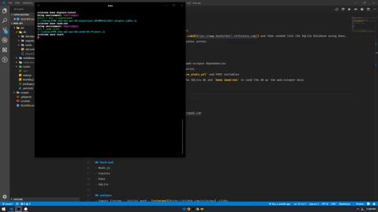

# :basketball: nba-api
NBA web API for player per game averages and other stats.
- All player data is scraped from [basketball-reference.com](https://www.basketball-reference.com/) and then seeded into the SQLite Database using Knex. Player data can then be accessed after starting your Express server.

## how to use
- Fork and clone.
- `cd` into `scraper` and run `npm install` to install web-scraper dependencies
- `cd` into `api` and run `yarn` to install API dependencies
- Create your .env file inside of `api` with your `player_stats_url` and PORT variables
- While in `api`, run `knex migrate:latest` to create the SQLite db and `knex seed:run` to seed the db w/ the web-scraper data
- Still inside `api`, run `yarn start` to start the API
- API will be running on `localhost:9000/api/players`



## sample .env file
```
player_stats_url=https://www.player-stats-site-to-be-scraped.com
PORT=9000
```

## web-scraper
- Cheerio
- Cheerio-Tableparser
- Request-Promise

## back-end
- Node.js
- Express
- Knex
- SQLite

## authors
- Sawyer Zincone -_initial work_- [szincone](https://github.com/szincone) :clubs:

## license
This project is licensed under the MIT License - see the [LICENSE](https://github.com/szincone/nba-api/blob/master/LICENSE) file for details.

[](https://opensource.org/licenses/MIT)
